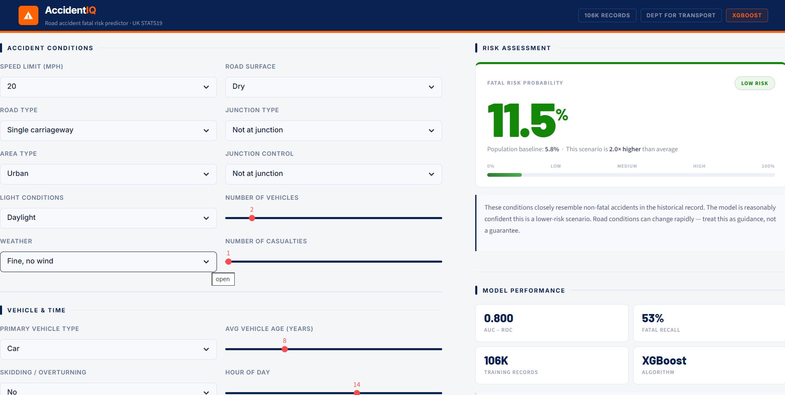

# AccidentIQ

**Road accident fatal risk predictor built on real UK government collision data.**

> 106,000+ accidents | UK STATS19 

"Which road conditions are actually dangerous?" has no honest, data-driven answer most people can access. AccidentIQ uses real STATS19 collision records from the UK Department for Transport to score any combination of road, vehicle, and environmental conditions by how likely they are to produce a fatal outcome.

The risk changes depending on what you input, speed limit, time of day, road surface, vehicle type because the same road means something different at 2am on a wet motorway versus noon on a dry urban street.

`Python 3.11` `Streamlit` `XGBoost` `scikit-learn` `SHAP` `joblib` `UK STATS19`

---

## What it does

- Takes 18 input features describing an accident scenario (road type, speed limit, lighting, weather, vehicle, time of day, etc.)
- Runs them through an XGBoost classifier trained on 106K real UK accidents
- Returns a fatal risk probability with a HIGH / MEDIUM / LOW classification
- Shows SHAP-based feature importance so you can see exactly what is driving the prediction

Model performance: AUC-ROC 0.800, Fatal Recall 53%. A random baseline scores 0.500 AUC and catches zero fatalities.

### Improvements in Version 2

- Sentinel values were handled once again, after reperforming EDA.
- Added an interaction feature speed_x_area (Now 19 features)
- Model performance: AUC-ROC 0.825, Fatal Recall 71%

---

<p align="center">
  
</p>

---

## Setup

**1. Clone and install**

```bash
git clone https://github.com/yourname/accidentiq.git
cd accidentiq
pip install -r requirements.txt
```

**2. Get the data**

Download the STATS19 accident data from the UK Department for Transport:
https://www.data.gov.uk/dataset/cb7ae6f0-4be6-4935-9277-47e5ce24a11f/road-safety-data

Place the cleaned CSV at `data/stats19_clean.csv`. The notebooks in `/notebooks` walk through the cleaning and feature engineering steps I performed. You may also view the data folder.

**3. Train the model**

```bash
jupyter notebook notebooks/4_modeling_v2.ipynb
```

This saves `xgb_fatal_predictor.pkl` to `models/`.

**4. Run the app**

```bash
uvicorn main:app --reload

streamlit run app.py
```

---

## Notes

- The project is ongoing and with continuous improvements.
- Built on UK data. Risk thresholds and feature weights reflect UK road conditions and may not transfer directly to Indian roads.
- Not for operational or safety-critical use. This is a personal data project.
- SHAP values shown in the UI are global importances computed on the 21K test split, not per-prediction local values.


